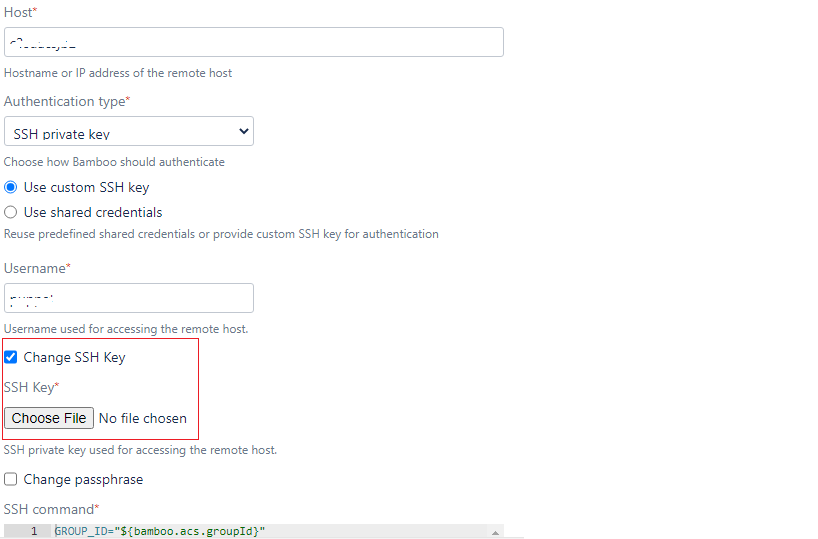
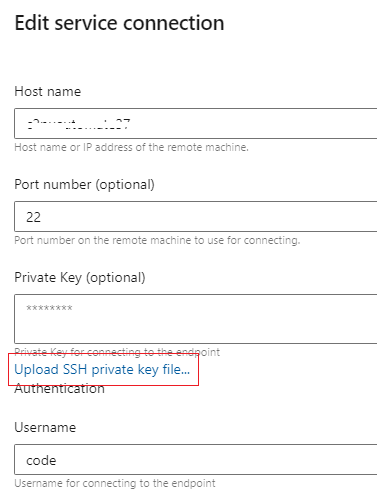

# Purpose
This document covers steps for generating SSH key pairs for deploying the applications to the Target VM from the Pipeline.

## Table of contents
  * [Purpose](#Purpose)
  * [Generate SSH Keys](#Generate-SSH-Keys)
    * [Test SSH Keys](#Test-SSH-Keys)
  * [Configure SSH Keys in Pipeline](#Configure-SSH-Keys-in-Pipeline)
    * [Bamboo](#Bamboo)
    * [ADO](#ADO) 


## Generate SSH Keys
- First, we need server access. To get server access to raise the SNOW - [Add/Revoke Server Access](https://premierprod.service-now.com/premiernow?id=dept_cat_item&sys_id=38f6b8d6db449090765f1d89139619d7)
Also mention, that we need Privileged Access (dzdo/sudo) = dzdo permissions needed for [server username]

- Once access is granted, log in to the server using your username from the command prompt and switch to the user using dzdo
  ```
  ssh username@server
  dzdo su - username
  ```

- Create a directory **.ssh** if it doesn't exist
  ```sh
  mkdir -p ~/.ssh
  chmod 700 ~/.ssh
  cd ~/.ssh
  ```

- Command to Generate SSH key pair
  ```bash
  ssh-keygen -t rsa -m pem -f ~/.ssh/id_rsa
  ```
- Press Enter if it prompts for password.
- Once the key pairs, you can view the content of the key pairs using **cat** command
- To view the public key: `cat ~/.ssh/id_rsa.pub`
- To view the private key: `cat ~/.ssh/id_rsa`
- Copy RSA private keys and save them locally as a text file.
- Copy public keys from id_rsa.pub to authorized_keys
  ```bash
  cat ~/.ssh/id_rsa.pub >> ~/.ssh/authorized_keys
  ```
- Finally set the permission of authorized_keys
  ```bash
  chmod 600 ~/.ssh/authorized_keys
  ```

## Test SSH Keys
- In order to test the SSH key, open a terminal (command prompt or powershell) in your local workstation. 
- Change to the directory where the Private Key created in previous stage has been stored. 
- Connect server via SSH
  ```bash
  chmod 600 <private-key.txt> # to set the permission
  ssh -i <private-key.txt> <username>@<servername>
  ```
- If there is an issue, or it prompts for password, it means you haven't configured the key pair properly on the server


## Configure SSH Keys in Pipeline

## Bamboo
- In the bamboo SSH Task or in SCP Task, you can upload the private key file as shown in below image

  

## ADO
- Open Project settings in ADO and select service connections under _Pipeline_.
- Click "New Service Connection", search SSH and Next.
- Add required information in all fields and upload SSH private keys from local.
- Name the Service connection as [username]_[servername] format.

  


