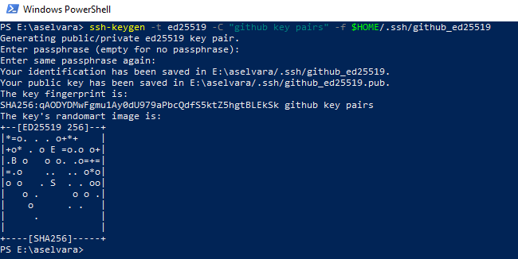
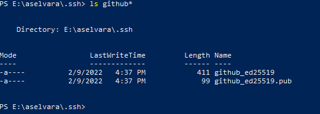
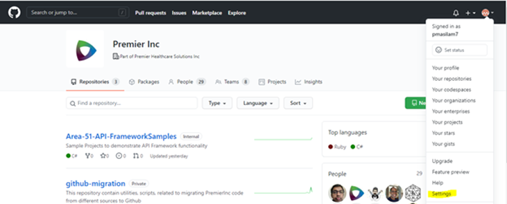
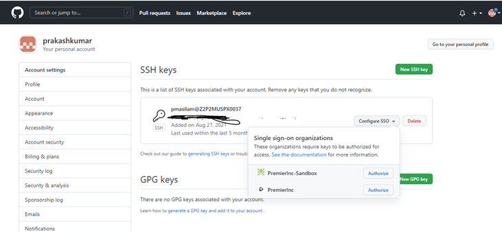
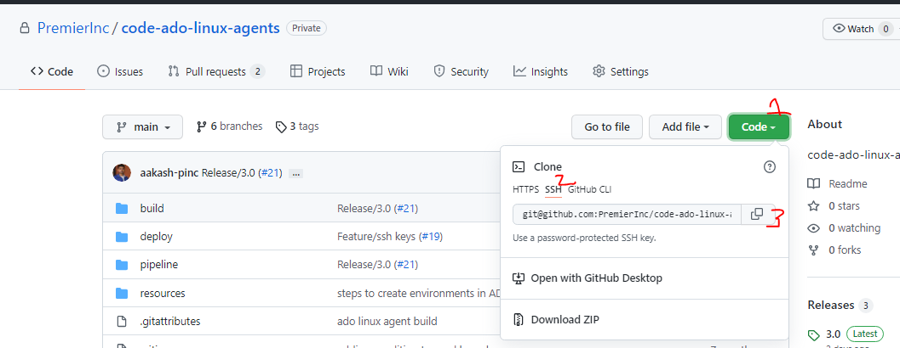

# Configure SSH Keys in GitHub
This document covers the steps to create and configure SSH Key pairs in GitHub so that you can clone the repositories using SSH keys instead of HTTPS (username/password) authentication. 


## Stage 1: Create SSH Key Pair

- Open Powershell (windows) / terminal (linux).
- Run the below command to create new SSH Key Pairs.
```bash
ssh-keygen -t ed25519 -f <path>

# for example
ssh-keygen -t ed25519 -f $HOME/.ssh/github_ed25519
```
- Press **Enter** without typing anything if it prompts for PassPhrase. This creates SSH key pairs without password/passphrase. 
  
- Now you will see two files (_github_ed25519_ and _github_ed25519.pub_) created under your _$HOME/.ssh_ folder.
  
## Stage 2: Create config file
Normally, SSH uses port 22 for its operation which is blocked by Premier Firewall. GitHub knows this and allows SSH cloning via port 443.  In order to use that port, we need to create a _config_ file under _$HOME/.ssh_ folder. 

- Create file: `$HOME/.ssh/config` 
- Copy the below content to that file. 
```
Host *
  AddKeysToAgent yes
  
Host github.com
  Hostname ssh.github.com
  Port 443
  User git
  IdentityFile /e/aselvara/.ssh/github_ed25519
  StrictHostKeyChecking no
```
> **NOTE**: 
> - Under the identity file, provide the location of the ssh private key file in your username. 
> - Make sure the file name is `config` and not `config.txt`


## Stage 3: Configure SSH Key in GitHub
In this stage, we will configure the ssh public key in GitHub.

- Open the `$HOME/.ssh/github_ed25519.pub` file in a text editor and copy its contents. 
- Login to PremierInc ORG Github URL: https://github.com/PremierInc


- Click the profile icon on the top right and select settings.


- Select **SSH and GPG Keys** on the left side.
- Click **New SSH Key** button and paste the copied public key contents here. 
- After adding the public key, we have to enable the SSO for this public key. Click **Configure SSO** as shown in below and authorize **PremierInc** organization.


## Final Stage: Clone Repository using SSH.
- Open the repository to be cloned in the GitHub and copy the SSH URL.


- Open the Powershell / Command Prompt / Terminal.
- Switch to the directory where you want to clone the repository. For example, I create a directory **GitHubRepos** inside my $HOME directory to have all my GitHub Repositories.
  ```bash
  cd ~/GitHubRepos/
  ``` 
- Run the `git clone` command.
  ```bash
  git clone git@github.com:PremierInc/code-ado-linux-agents.git
  ```
  
 


